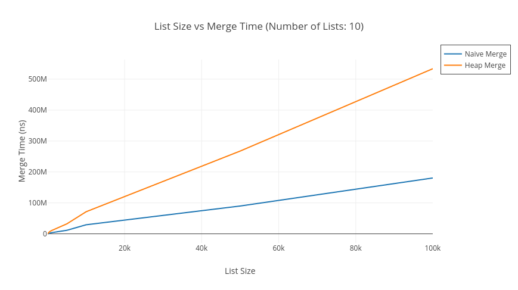
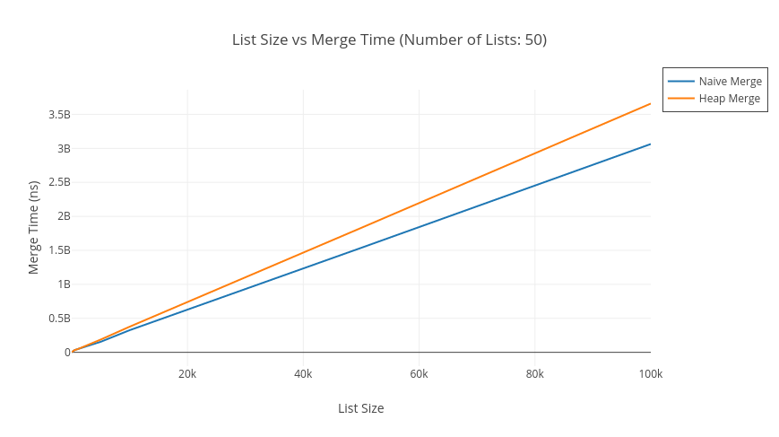
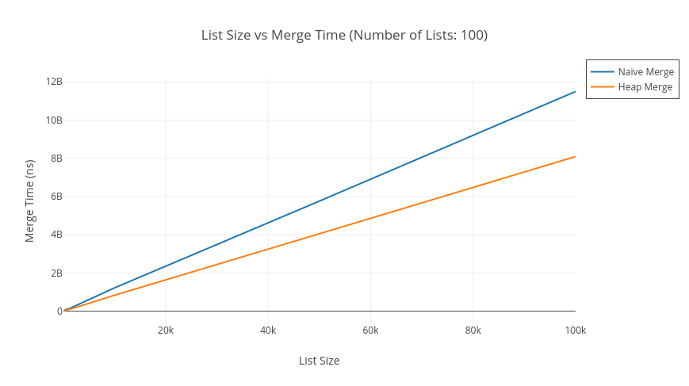

# Merge K Sorted Lists: Comparing performance of naive vs heap based implementations
  When merging k sorted lists, two possible methods are:
  - Get the smallest element from each list and find the minimum among them. Add this element to the merged list. Delete this element from its source list. This step takes O(k) time and has to be done for each element. If the combined elements accross all lists is n, then the complexity becomes O(n . k).
  - In this method, we create a min-heap of size k and add the first elements of each list to it. Now while the heap is not empty, we remove the top element and add this to the merged list, and add the next element from that particular source list to the heap. Thus each remove and subsequent addition takes O(lg(k)) time. Total time is O(n . lg(k)).
  
  This clearly shows that the second heap based approach should be much faster than the naive linear approach, and indeed it is when the values of k and n are sufficiently large. But in practice upto a certain number the naive approach outpaces the heap based approach.
  Some reasons for this speedup are related to how caching works in processors:
  - Data is follows the path from disk -> RAM -> L3 Cache -> L2 Cache -> L1 Cache. The speed of read/write becomes much faster as we go on this path.
  - The processor performs all computations in the L1 cache, and if the program is written in a way that we reuse information, it will remain in the cache and make the program faster.
  - Cache line reuse is done in two ways: spatial locality (things that are used closely in time are also close in the memory, e.g array traversal) and temporal locality (same things are accessed many times withing a short time).
  - Branch prediction and prefetching: The processor has a unit that observes the patterns of data access and tries to predict which information will be needed, ahead of time. E.g if-else conditions.
  - It turns out that for many use-cases, programs written in a simple manner like linear scans, allow much better branch prediction and cache line reuse and thus perform faster, even though their time complexity accrording to Big-O-Notation is worse.
  
# Code
  - The code in merge_list.cpp has multiple sorted lists of random integers. It merges the lists by both naive approach and heap based approach and reports the average time in nanoseconds, taken accross 10 iterations for both cases.
  - To build the code run the following on the command line. ```$ make```
  - To run type ```$ ./merge_list 100 1000```. The two arguments in this example 100 = number of sorted lists, 1000 = size of each list.

# Results
  - When the number of lists is small upto 50, the naive implementation is faster, even though the size of each list is significantly large (~100,000). This is because the path of linear scan for smallest element is predictible and offers good spatial locality. In contrast the lg(k) time for heap retrieval, does not offer better branch predicition. This might be the limiting factor when number of lists are small.
  - When the number of lists is larger, the lg(k) lookup time starts to kick in for each smallest elements lookup.
  - The runtimes for each case are listed in [Results(Nanoseconds).txt](Results-Nanoseconds.txt)
  - The comparison plots for naive vs heap are in the following files: 
    
    
    
